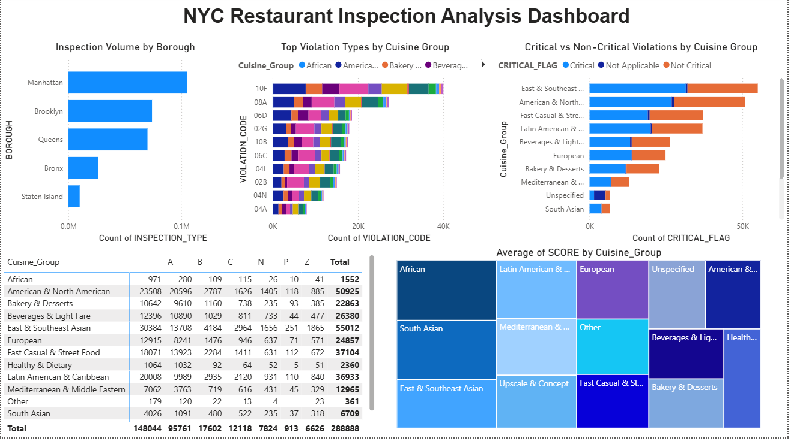

# NYC Restaurant Inspection Analysis Dashboard

## Overview
This project analyzes **NYC Department of Health and Mental Hygiene (DOHMH)** restaurant inspection data to uncover inspection volume, violation patterns, and food safety risk across **boroughs, cuisine groups, and neighborhoods**.  
The objective is to identify **high-risk patterns** that can support **inspection prioritization and targeted food-safety training**.

The analysis was performed using **SQL Server** for data preparation and **Power BI** for interactive visualization.

---

## Data Source
- NYC DOHMH Restaurant Inspection Results (public dataset)
- ~280,000+ inspection records
- Includes inspection dates, grades, violation codes, critical flags, cuisine descriptions, and geographic attributes

---

## Tools & Technologies
- **SQL Server (SSMS)**
  - Table creation and schema design
  - Data cleaning and standardization
  - Null handling and data type conversion
  - Validation and aggregation queries
- **Power BI**
  - Interactive dashboards and visual analytics
  - Bar charts, stacked bar charts, matrix tables, treemaps
  - Top N analysis, visual-level filters, and tooltips
- **Excel**
  - Initial data review and validation

---

## Data Preparation
Key preparation steps included:
- Creating a raw inspections table to store all source columns
- Trimming and standardizing text fields (e.g., cuisine descriptions)
- Converting inspection date fields to proper date formats
- Handling missing and invalid values
- Grouping cuisines into standardized **Cuisine Groups** to reduce noise and improve analysis

---

## Key Analyses
- **Inspection Volume:** Distribution of inspections by borough
- **Violation Analysis:** Top 10 most frequent violation types by cuisine group
- **Severity Analysis:** Comparison of critical vs non-critical violations
- **Grading Outcomes:** Grade distribution (A, B, C, Pending) by cuisine group
- **Performance Comparison:** Average inspection score by cuisine group

---

## Key Insights
- Inspection activity is concentrated in **Manhattan and Brooklyn**, reflecting restaurant density.
- A small number of violation types (primarily food handling and sanitation issues) account for a large share of total violations.
- Certain cuisine groups show consistently higher violation counts, driven by operational complexity and inspection volume.
- **Grade A restaurants may still receive critical violations**, highlighting the importance of evaluating violation frequency and severity rather than relying on grades alone.

---

## Recommendations
- Prioritize inspections in boroughs and neighborhoods with consistently high critical violation counts.
- Target food-safety training for cuisine groups associated with repeat high-risk violations.
- Use violation patterns in addition to grades to guide inspection strategy and public health interventions.

---

## Dashboard Preview

---

## 📬 Contact
Feel free to reach out if you’d like to discuss this project or collaborate on similar data analysis work.
